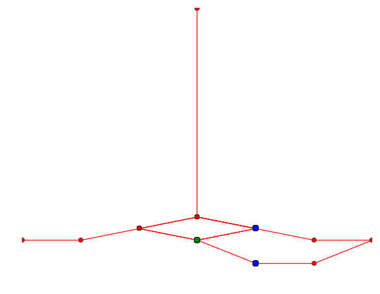

==========================
Line Combination Algorithm
==========================

Imported train tracks often run in parallel. It is however
not even possible to distinguish between two tracks at a
mid-level zoom levels. Thus, we propose a simple algorithm
that takes care of this matter and combines several parallel
train tracks.

Angle-based Combination
-----------------------

The angle-based combination algorithm works as follows::

    for each intersection:
        if the angle between two neighbors n₁ and n₂ is < ε:
            (if the length of the line segment n₁ n₂ is <  δ:)
                replace n₁ and n₂ with a node located at the
                midpoint of the line segment

.. autofunction:: algolab.combine.anglecombine

Full Example
^^^^^^^^^^^^

What follows is a step by step run of the anglecombine algorithm. In each
step, the angle between the points marked in green and blue (vertices are green)
is calculated and checked against epsilon. If it is smaller than epsilon, then
the blue points are merged.

.. image:: img/comb.gif

Or without animation:

.. image:: img/comb-3.png

