.. _final_report:

============
Final Report
============

This document describes how the complete graphs for all zoom levels
were constructed and how well our algorithms did. It is assumed
that you have correctly :ref:`setup` your environment.

Introduction
============

We used a combination of multiple algorithms, namely the Ramer-Douglas-Peucker Algorithm
(:func:`~algolab.simplify.rdp`), an angle-based Line Combination Algorithm
(:func:`~algolab.combine.anglecombine`), and a Clustering Algorithm
(:func:`~algolab.stations.cluster_stations`).

Where appropriate, our algorithms operate on a spherical mercator projections adapted
to the region of interest (see :func:`~algolab.util.ll2xy`).
This also means that the parameter given to :func:`~algolab.simplify.rdp` is in meters.

Result Reproduction
===================

Step 1: OSM Import
------------------

This step imports the railway graph from the osm data::

    java -jar osm_railway_graph_import.jar germany.osm 127.0.0.1 27017

Step 2: Our Algorithms
----------------------

This is the step were our project kicks in. It works on the railway
graph and produces a generalized railway graph for each zoom level.

The main entry point for producing generalized railway graphs is
``al_tool``:

  .. program-output:: al_tool --help

It has three subcommands: ``al_tool prepare``, ``al_tool stations`` and
``al_tool filter``. Each subcommand has its own ``--help`` option.

.. note::

   The scripts in ``bin/`` assume that the ``algolab`` code tree is in its
   parent directory. If you want to change the provided directory structure add the
   directory that contains ``algolab`` to the ``PYTHONPATH`` or place ``algolab``
   into a directory that is already in it.

The zoom levels indicate what collection will be produced. For example, running
``al_tool filter 14`` will produce the collection ``railway_graph_14``. Multiple
zoom levels can be specified (e.g. ``al_tool filter 16 15 14``), but keep in
mind that a zoom level usually depends on its predecessor level. Additionally,
you can create all zoomlevels using ``al_tool filter --all-zoomlevels``.

In the following sections, the images on the left-hand side represent
the Frankfurt Main Station and the image on the right-hand side represent
the Rhine-Main-Area (Frankfurt, Mainz, Darmstadt).

After importing OSM data you need to execute these steps:

  #. ``al_tool prepare``
  #. ``al_tool stations``
  #. ``al_tool filter``

Of course each with appropriate arguments. Furthermore, ``al_tool stations``
generates a ``ZoomLevelStations.txt`` (you can influence where this is written
using the ``-f`` option).

.. note::

    Zoom level 17 is no zoom level that is used by Google Maps. Instead, this
    zoom level is our general cleaning stat that does the following:

    - Removed nodes that have no neighbors

    - Remove duplicates (nodes with the same ``loc`` attribute)

    - Recalculate all distances (great-circle distance)

    This step can be executed by running::

        al_tool prepare

.. all images were produced using:
   al_visualize_rg -s doc/img/step-x.png -t "Zoom Level x" \
                   --dpi 75 -c railway_graph_x
   or simply:
   al_visualize_report `seq 8 16`

Algorithm Combination Summary
=============================

The following table illustrates how our algorithms were combined:

+------------+---------------------------------------------------------------------------------------------+
| Zoom level | Algorithms used                                                                             |
+============+=============================================================================================+
|         17 | :func:`~algolab.db.dedup`, :func:`~algolab.db.delonelynize`                                 |
+------------+---------------------------------------------------------------------------------------------+
|         16 | :func:`~algolab.simplify.rdp` with ε=1.6m                                                   |
+------------+---------------------------------------------------------------------------------------------+
|         15 | :func:`~algolab.simplify.rdp` with ε=3.2m                                                   |
+------------+---------------------------------------------------------------------------------------------+
|         14 | :func:`~algolab.simplify.rdp` with ε=4.8m                                                   |
+------------+---------------------------------------------------------------------------------------------+
|         13 | :func:`~algolab.simplify.rdp` with ε=6.4m                                                   |
+------------+---------------------------------------------------------------------------------------------+
|         12 | :func:`~algolab.simplify.rdp` with ε=8.0m                                                   |
+------------+---------------------------------------------------------------------------------------------+
|         11 | :func:`~algolab.stations.cluster_stations`, :func:`~algolab.simplify.rdp` with ε=6.5m       |
+------------+---------------------------------------------------------------------------------------------+
|         10 | :func:`~algolab.combine.anglecombine` with ε=10°, :func:`~algolab.simplify.rdp` with ε=6.5m |
+------------+---------------------------------------------------------------------------------------------+
|          9 | :func:`~algolab.simplify.rdp` with ε=10m                                                    |
+------------+---------------------------------------------------------------------------------------------+
|          8 | :func:`~algolab.simplify.rdp` with ε=20m                                                    |
+------------+---------------------------------------------------------------------------------------------+

Area Results
============

Germany
-------
This section is devoted to the entire map of Germany.

Log
^^^

.. include:: logs/germany.txt

Summary
^^^^^^^

+---------------------------------------------+
| Zoom Level | Node Count | Time Spent*       |
+============+============+===================+
|         17 |     870102 |                   |
+------------+------------+-------------------+
|         16 |     530949 | 0:25:10.156804    |
+------------+------------+-------------------+
|         15 |     415546 | 0:24:34.757645    |
+------------+------------+-------------------+
|         14 |     353204 | 0:23:47.648521    |
+------------+------------+-------------------+
|         13 |     314889 | 0:23:26.116278    |
+------------+------------+-------------------+
|         12 |     288764 | 0:24:23.728064    |
+------------+------------+-------------------+
|         11 |     146175 | 0:15:28.593292    |
+------------+------------+-------------------+
|         10 |      88164 | 0:09:16.321968    |
+------------+------------+-------------------+
|          9 |      82330 | 0:03:02.451902    |
+------------+------------+-------------------+
|          8 |      68066 | 0:03:04.658319    |
+------------+------------+-------------------+

* Corresponds to the time spent on a Thinkpad T420 (i5-2520M CPU @ 2.50 GHz, 8GB RAM).

Frankfurt
---------

Visualization
^^^^^^^^^^^^^

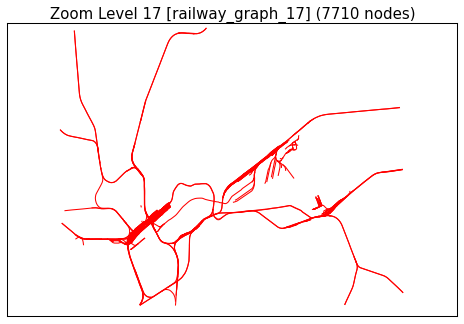
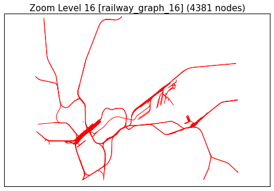
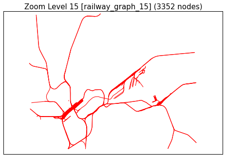
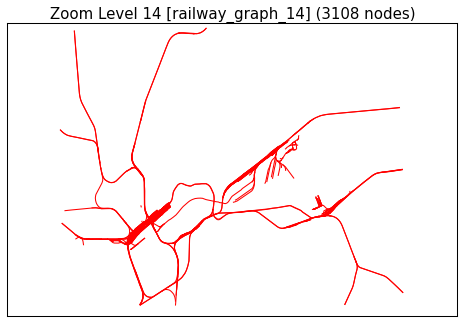

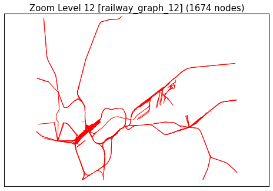
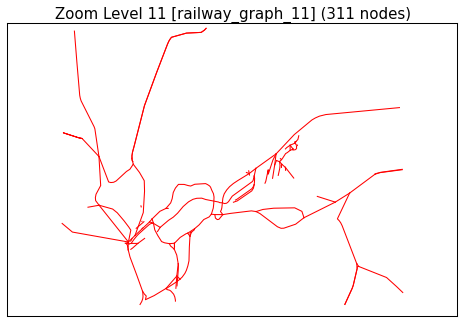
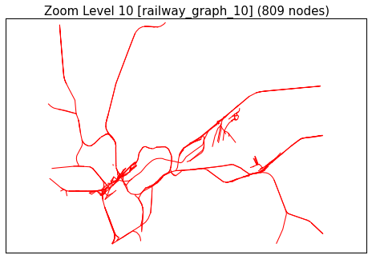
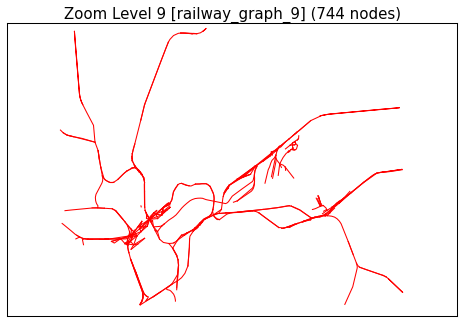
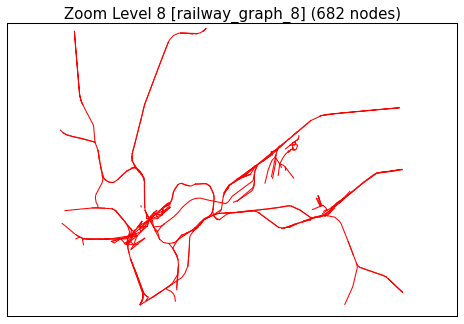

Screenshots
^^^^^^^^^^^

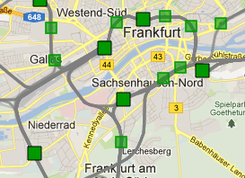

    Zoomlevel 12

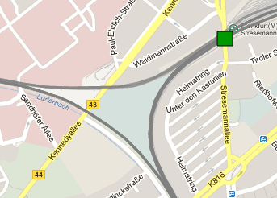

    Zoomlevel 15

Berlin
-------

Visualization
^^^^^^^^^^^^^

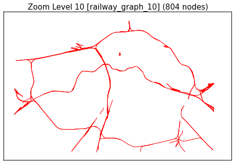

Screenshots
^^^^^^^^^^^

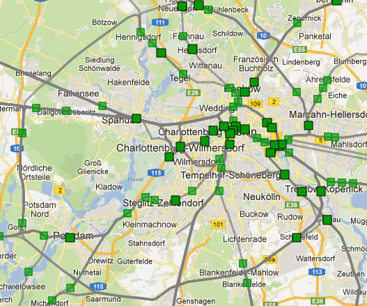

    Zoomlevel 10

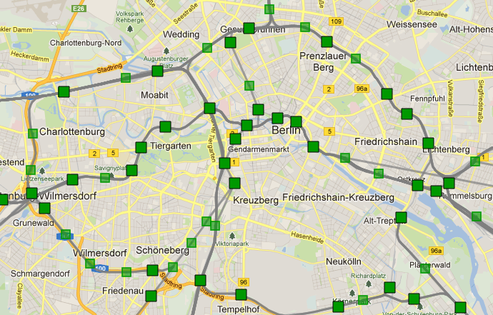

    Zoomlevel 12

Grifte-Edermünde
----------------

Visualization
^^^^^^^^^^^^^

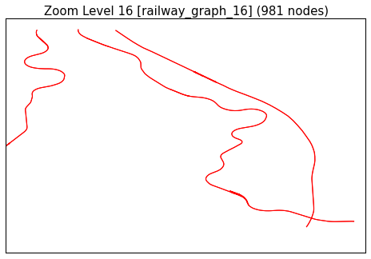

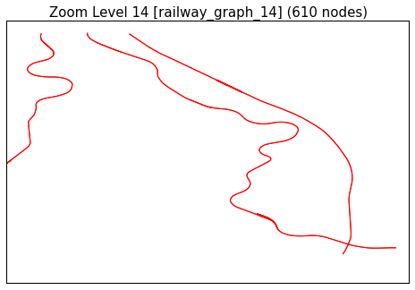
.. image:: img/grifte/rg-zl-13.png
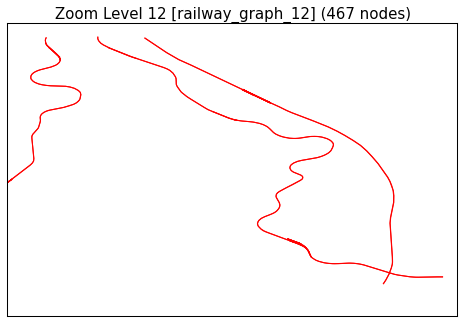
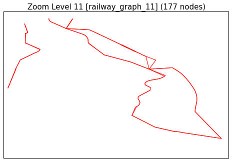
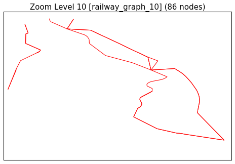
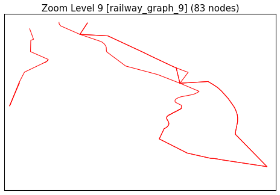
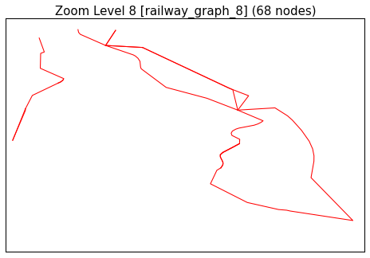

Screenshots
^^^^^^^^^^^

.. figure:: img/grifte/rv-zl10.png

    Zoomlevel 10

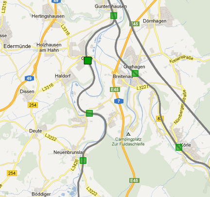

    Zoomlevel 12

Discarded Approaches
====================

Angle-Based-Reduction
---------------------

The approach described in :ref:`simp_angle` was not used because the
:ref:`simp_rdp` algorithm is superior under nearly all circumstances.

While they are somewhat similar, the ε-parameter of the RDP algorithm limits
the maximum deviation from the original train tracks in meters. The ε-parameter
of the angle-based algorithm on the other hand describes a threshold value
for angles, which may or may not linearly correspond to the perceived deviance
from the original image.

However, the algorithm could have been improved by first computing and then
sorting all angles in a segment instead of just checking if an angle
is within a certain threshold locally.

Filtering of railway graph nodes based on valuation
---------------------------------------------------

We planned to value railway graph nodes and omit nodes which did not exceed a
threshold appropriate for a given zoomlevel.

We did not pursued this approach as it was difficult to find suitable metrics to
value the nodes. This was easy for certain classes of nodes, e.g. nodes with a
nearby station or endpoints, but for most nodes we could not find a method to
valuate them.

Strong and Weak Points of the Algorithms
========================================

In the following we describe where our algorithms are strong (i.e. simplifying
the railway while staying true to general railway layout) and where their weak
spots are, resulting in a bad generalization of the railways.

As we combine all three algorithms and exploit their strengths weaknesses are
hard to detect in practice using MOTIS while theoretically possible or actually
present but not noticeable because they only affect minuscule details.

Ramer-Douglas-Peucker (RDP)
---------------------------

RDP has no weak points as long as the used ε-parameter is chosen such that it is
suitable for the zoom level, i.e. the ε is roughly equal to the perceivable
deviations from the railroad tracks.

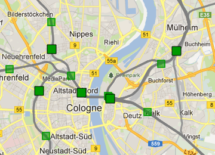

    Zoomlevel 12 around Cologne

If ε is chosen inappropriately, applying RDP will converge to straight lines
with a growing ε. This means in turn that as long as ε is apt, a bad performance
of RDP can only result in a hardly simplified railway segment (i.e. a segment
with a similar high node count).

Angle-Combining (AC)
--------------------

AC has a limited application scenario: combine railroad sections that branch off
from a single track. This can be observed at larger stations.

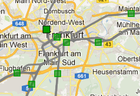

    Zoomlevel 10 around Frankfurt/Main

AC produces weak results if the input data is suboptimal. Two train tracks can run
in parallel even if the angle between the branch point and its two neighbors
is rather large. The following image demonstrates this problem:

.. plot::

    from algolab.plot import plot_datasets

    plot_datasets([12, 14, 15, 18], title=" ", legend=False).show()

In this figure, the angle between 1 (vertex), 2, and 7 is quite large. This
causes the AC algorithm to not combine these two train tracks. Thus, bad
performance of AC translates to not applying the algorithm to train tracks
it should be applied to.

Clustering
----------

Strong points for Clustering are regions with a high density of stations as this
keeps the clustering radii small. Naturally, this limits the utility of this
algorithm. Furthermore, small radii can be achieved by using appropriate
parameters.

    Zoomlevel 11 around Frankfurt/Main

This also means that weak points for Clustering are regions with a low density
of stations and furthermore with a much less than linear routing. We can see
such a weak point around Grifte-Edermünde in the visualization from zoom level
11 downwards (zoom level 11 is where clustering will be applied in the delivered
configuration). Here the clustering radii are comparatively big and many railway
graph nodes will be mapped to a station which in turn means that previously
distinct segments may coincide with each other after the clustering.
Fortunately, this is not noticeable in Motis (which unfortunately means that we
can't provide a screenshot).

