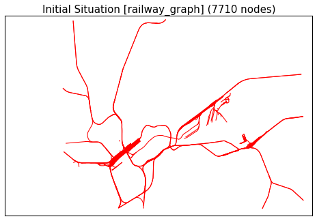
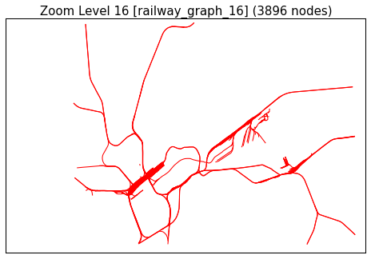

.. _final_report:

====================
Final Report (Draft)
====================

This document describes how the complete graphs for all zoom levels
were constructed and how well our algorithms did.

Foreword
========

We used a combination of multiple algorithms, namely the Ramer-Douglas-Peucker Algorithm
(:func:`~algolab.simplify.rdp`), an angle-based Line Combination Algorithm
(:func:`~algolab.combine.anglecombine`), and a Clustering Algorithm
(:func:`~algolab.stations.cluster_stations`).

Where appropriate, our algorithms operate on a spherical mercator projections adapted
to the points being used. Because the global mercator projection was too inaccurate
(distance between Darmstadt and Frankfurt being 41km instead of 27km), we chose to use
a transverse mercator projection with a meridian lying near the center of the region
of interest (51°N).

Step 1: OSM Import
==================

This step imports the railway graph from the osm data::

    java -jar osm_railway_graph_import.jar germany.osm 127.0.0.1 27017

Step 2: Our Algorithms
======================

This is the step were our project kicks in. It works on the railway
graph and produces a generalized railway graph for each zoom level.

The main entry point for producing generalized railway graphs is
`al_filter`:

  .. program-output:: al_filter --help

The zoom levels indicate what collection will be produced. For example,
running `al_filter 14` will produce the collection `railway_graph_14`.
Multiple zoom levels can be speciefied (e.g. `al_filter 30 16 15 15`), but
keep in mind that a zoom level usually depends on its predecessor level.

In the following sections, the images on the left-hand side represent
the Frankfurt Main Station and the image on the right-hand side represent
Germany.

Zoom level 30
-------------

This is no zoom level that is used by google maps. Instead, this
is our general cleaning step that does the following:

- Remove nodes that have no neighbors

- Remove duplicates (nodes with the same `loc` attribute)

- Recalculate all distances (great-circle distance)

This step can be executed by running::

    al_filter 30

This yields an output similar to this::

    [2013-02-11 15:58:03,379] => Starting step 'Cleaning'
    [2013-02-11 15:59:11,066] --------------------------------------------------
    [2013-02-11 15:59:11,066] => Starting step 'Removing lonely nodes'
    [2013-02-11 15:59:12,221] Reduced to 870136 nodes from 870136 nodes. Change: -0 (-0.000%)
    [2013-02-11 15:59:12,222] <= Step 'Removing lonely nodes' finished (took 0:00:01.155797).
    [2013-02-11 15:59:12,222] --------------------------------------------------
    [2013-02-11 15:59:12,222] => Starting step 'Removing duplicates'
    [2013-02-11 16:00:11,533] Reduced to 870102 nodes from 870136 nodes. Change: -34 (-0.004%)
    [2013-02-11 16:00:11,534] <= Step 'Removing duplicates' finished (took 0:00:59.311332).
    [2013-02-11 16:00:11,534] --------------------------------------------------
    [2013-02-11 16:00:11,534] => Starting step 'Recalculating all distances'
    [2013-02-11 16:26:23,383] <= Step 'Recalculating all distances' finished (took 0:26:11.848222).
    [2013-02-11 16:26:23,383] <= Step 'Cleaning' finished (took 0:28:20.004077).

.. all images were produced using
   al_visualize_rg -s doc/img/step-x.png -t "Zoom Level x" \
                   --dpi 75 -c railway_graph_x

Initial Situation
-----------------

Zoom level 16
-------------

This step applies :func:`~algolab.simplify.rdp` with
ε=1.5m to and can be executed via::

    al_filter 16

Zoom level 15
-------------

Zoom level 14
-------------

Zoom level 13
-------------

Zoom level 12
-------------

Zoom level 11
-------------

Zoom level 10
-------------

Zoom level 9
------------

Zoom level 8
------------

Node Quantity Results
---------------------

The following table illustrates the application of our algorithms
and the result thereof.

+------------+------------------------------+------------------+--------------------+
| Zoom level | Algorithms used              | #nodes (Germany) | #nodes (Frankfurt) |
+============+==============================+==================+====================+
|            |                              | 870136           | 7710               |
+------------+------------------------------+------------------+--------------------+
| 30         | dedup, delonelynize          | 870102           |                    |
+------------+------------------------------+------------------+--------------------+
| 16         | rdp(ε=1.5m)                  | 502150           |                    |
+------------+------------------------------+------------------+--------------------+
| 15         | rdp(ε=2.5m)                  | 416559           |                    |
+------------+------------------------------+------------------+--------------------+
