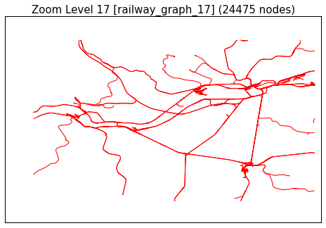
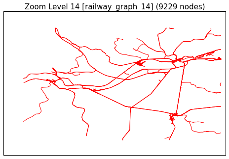
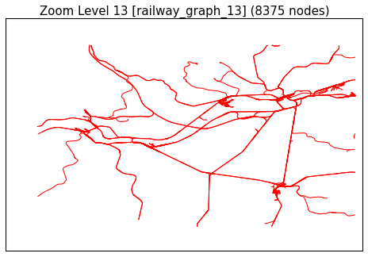
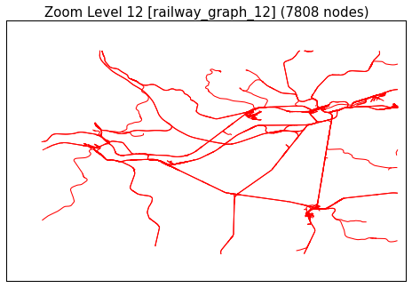
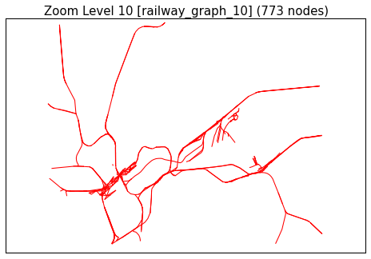
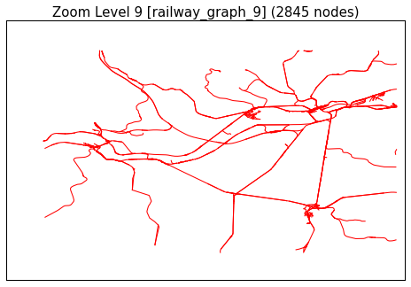

.. _final_report:

====================
Final Report (Draft)
====================

This document describes how the complete graphs for all zoom levels
were constructed and how well our algorithms did. It is assumed
that you have correctly :ref:`setup` your environment.

Introduction
============

We used a combination of multiple algorithms, namely the Ramer-Douglas-Peucker Algorithm
(:func:`~algolab.simplify.rdp`), an angle-based Line Combination Algorithm
(:func:`~algolab.combine.anglecombine`), and a Clustering Algorithm
(:func:`~algolab.stations.cluster_stations`).

Where appropriate, our algorithms operate on a spherical mercator projections adapted
to the region of interest (see :func:`~algolab.util.ll2xy`).
This also means that the parameter given to :func:`~algolab.simplify.rdp` is in meters.

Step 1: OSM Import
==================

This step imports the railway graph from the osm data::

    java -jar osm_railway_graph_import.jar germany.osm 127.0.0.1 27017

Step 2: Our Algorithms
======================

This is the step were our project kicks in. It works on the railway
graph and produces a generalized railway graph for each zoom level.

The main entry point for producing generalized railway graphs is
``al_tool``:

  .. program-output:: al_tool --help

It has three subcommands: ``al_tool prepare``, ``al_tool stations`` and
``al_tool filter``. Each subcommand has its own ``--help`` option.

.. note::

   The scripts in ``bin/`` assume that the ``algolab`` code tree is in its
   parent directory. If you want to change the provided directory structure add the
   directory that contains ``algolab`` to the ``PYTHONPATH`` or place ``algolab``
   into a directory that is already in it.

The zoom levels indicate what collection will be produced. For example, running
``al_tool filter 14`` will produce the collection ``railway_graph_14``. Multiple
zoom levels can be specified (e.g. ``al_tool filter 16 15 14``), but keep in
mind that a zoom level usually depends on its predecessor level. Additionally,
you can create all zoomlevels using ``al_tool filter --all-zoomlevels``.

In the following sections, the images on the left-hand side represent
the Frankfurt Main Station and the image on the right-hand side represent
the Rhine-Main-Area (Frankfurt, Mainz, Darmstadt).

After importing OSM data you need to execute these steps:

  #. ``al_tool prepare``
  #. ``al_tool stations``
  #. ``al_tool filter``

Of course each with appropriate arguments. Furthermore, ``al_tool stations``
generates a ``ZoomLevelStations.txt`` (you can influence where this is written
using the ``-f`` option).

Zoom level 17
-------------

This is no zoom level that is used by Google maps. Instead, this
is our general cleaning step that does the following:

- Remove nodes that have no neighbors

- Remove duplicates (nodes with the same ``loc`` attribute)

- Recalculate all distances (great-circle distance)

This step can be executed by running::

    al_tool prepare

This yields an output similar to this::

    [2013-02-11 15:58:03,379] => Starting step 'Cleaning'
    [2013-02-11 15:59:11,066] --------------------------------------------------
    [2013-02-11 15:59:11,066] => Starting step 'Removing lonely nodes'
    [2013-02-11 15:59:12,221] Reduced to 870136 nodes from 870136 nodes. Change: -0 (-0.000%)
    [2013-02-11 15:59:12,222] <= Step 'Removing lonely nodes' finished (took 0:00:01.155797).
    [2013-02-11 15:59:12,222] --------------------------------------------------
    [2013-02-11 15:59:12,222] => Starting step 'Removing duplicates'
    [2013-02-11 16:00:11,533] Reduced to 870102 nodes from 870136 nodes. Change: -34 (-0.004%)
    [2013-02-11 16:00:11,534] <= Step 'Removing duplicates' finished (took 0:00:59.311332).
    [2013-02-11 16:00:11,534] --------------------------------------------------
    [2013-02-11 16:00:11,534] => Starting step 'Recalculating all distances'
    [2013-02-11 16:26:23,383] <= Step 'Recalculating all distances' finished (took 0:26:11.848222).
    [2013-02-11 16:26:23,383] <= Step 'Cleaning' finished (took 0:28:20.004077).

.. all images were produced using
   al_visualize_rg -s doc/img/step-x.png -t "Zoom Level x" \
                   --dpi 75 -c railway_graph_x

Zoom level 16
-------------

.. image:: img/ffm/rg-zl-16.png
.. image:: img/fma/rg-zl-16.png

Zoom level 15
-------------

.. image:: img/ffm/rg-zl-15.png
.. image:: img/fma/rg-zl-15.png

Zoom level 14
-------------

.. image:: img/ffm/rg-zl-14.png

Zoom level 13
-------------

.. image:: img/ffm/rg-zl-13.png

Zoom level 12
-------------

.. image:: img/ffm/rg-zl-12.png

Zoom level 11
-------------

.. image:: img/ffm/rg-zl-11.png

Zoom level 10
-------------

Zoom level 9
------------

Zoom level 8
------------

.. image:: img/ffm/rg-zl-8.png

Node Quantity Results
---------------------

The following table illustrates the application of our algorithms
and the result thereof.

+------------+---------------------------------------------------------------------------------------------+---------------+---------------------+-------------+
| Zoom level | Algorithms used                                                                             | # (Frankfurt) | # (Rhine-Main-Area) | # (Germany) |
+============+=============================================================================================+===============+=====================+=============+
|         17 | :func:`~algolab.db.dedup`, :func:`~algolab.db.delonelynize`                                 |          7710 |               24475 |      870102 |
+------------+---------------------------------------------------------------------------------------------+---------------+---------------------+-------------+
|         16 | :func:`~algolab.simplify.rdp` with ε=1.3m                                                   |          4381 |               13185 |      565479 |
+------------+---------------------------------------------------------------------------------------------+---------------+---------------------+-------------+
|         15 | :func:`~algolab.simplify.rdp` with ε=2.6m                                                   |          3553 |               10563 |      449172 |
+------------+---------------------------------------------------------------------------------------------+---------------+---------------------+-------------+
|         14 | :func:`~algolab.simplify.rdp` with ε=3.9m                                                   |          3108 |                9229 |      384183 |
+------------+---------------------------------------------------------------------------------------------+---------------+---------------------+-------------+
|         13 | :func:`~algolab.simplify.rdp` with ε=5.2m                                                   |          2822 |                8375 |      341792 |
+------------+---------------------------------------------------------------------------------------------+---------------+---------------------+-------------+
|         12 | :func:`~algolab.simplify.rdp` with ε=6.5m                                                   |          2652 |                7808 |      312884 |
+------------+---------------------------------------------------------------------------------------------+---------------+---------------------+-------------+
|         11 | :func:`~algolab.stations.cluster_stations`, :func:`~algolab.simplify.rdp` with ε=6.5m       |          1603 |                5398 |      157001 |
+------------+---------------------------------------------------------------------------------------------+---------------+---------------------+-------------+
|         10 | :func:`~algolab.combine.anglecombine` with ε=10°, :func:`~algolab.simplify.rdp` with ε=6.5m |           809 |                3061 |       95080 |
+------------+---------------------------------------------------------------------------------------------+---------------+---------------------+-------------+
|          9 | :func:`~algolab.simplify.rdp` with ε=10m                                                    |           757 |                2845 |       84695 |
+------------+---------------------------------------------------------------------------------------------+---------------+---------------------+-------------+
|          8 | :func:`~algolab.simplify.rdp` with ε=20m                                                    |           689 |                2543 |       69274 |
+------------+---------------------------------------------------------------------------------------------+---------------+---------------------+-------------+
