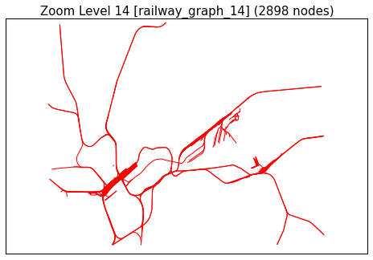
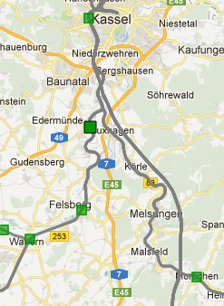

.. _final_report:

====================
Final Report (Draft)
====================

This document describes how the complete graphs for all zoom levels
were constructed and how well our algorithms did. It is assumed
that you have correctly :ref:`setup` your environment.

Introduction
============

We used a combination of multiple algorithms, namely the Ramer-Douglas-Peucker Algorithm
(:func:`~algolab.simplify.rdp`), an angle-based Line Combination Algorithm
(:func:`~algolab.combine.anglecombine`), and a Clustering Algorithm
(:func:`~algolab.stations.cluster_stations`).

Where appropriate, our algorithms operate on a spherical mercator projections adapted
to the region of interest (see :func:`~algolab.util.ll2xy`).
This also means that the parameter given to :func:`~algolab.simplify.rdp` is in meters.

Result Reproduction
===================

Step 1: OSM Import
------------------

This step imports the railway graph from the osm data::

    java -jar osm_railway_graph_import.jar germany.osm 127.0.0.1 27017

Step 2: Our Algorithms
----------------------

This is the step were our project kicks in. It works on the railway
graph and produces a generalized railway graph for each zoom level.

The main entry point for producing generalized railway graphs is
``al_tool``:

  .. program-output:: al_tool --help

It has three subcommands: ``al_tool prepare``, ``al_tool stations`` and
``al_tool filter``. Each subcommand has its own ``--help`` option.

.. note::

   The scripts in ``bin/`` assume that the ``algolab`` code tree is in its
   parent directory. If you want to change the provided directory structure add the
   directory that contains ``algolab`` to the ``PYTHONPATH`` or place ``algolab``
   into a directory that is already in it.

The zoom levels indicate what collection will be produced. For example, running
``al_tool filter 14`` will produce the collection ``railway_graph_14``. Multiple
zoom levels can be specified (e.g. ``al_tool filter 16 15 14``), but keep in
mind that a zoom level usually depends on its predecessor level. Additionally,
you can create all zoomlevels using ``al_tool filter --all-zoomlevels``.

In the following sections, the images on the left-hand side represent
the Frankfurt Main Station and the image on the right-hand side represent
the Rhine-Main-Area (Frankfurt, Mainz, Darmstadt).

After importing OSM data you need to execute these steps:

  #. ``al_tool prepare``
  #. ``al_tool stations``
  #. ``al_tool filter``

Of course each with appropriate arguments. Furthermore, ``al_tool stations``
generates a ``ZoomLevelStations.txt`` (you can influence where this is written
using the ``-f`` option).

.. note::

    Zoom level 17 is no zoom level that is used by Google Maps. Instead, this
    zoom level is our general cleaning stat that does the following:

    - Removed nodes that have no neighbors

    - Remove duplicates (nodes with the same ``loc`` attribute)

    - Recalculate all distances (great-circle distance)

    This step can be executed by running::

        al_tool prepare

.. all images were produced using:
   al_visualize_rg -s doc/img/step-x.png -t "Zoom Level x" \
                   --dpi 75 -c railway_graph_x
   or simply:
   al_visualize_report `seq 8 16`

Algorithm Combination Summary
=============================

The following table illustrates how our algorithms were combined:

+------------+---------------------------------------------------------------------------------------------+
| Zoom level | Algorithms used                                                                             |
+============+=============================================================================================+
|         17 | :func:`~algolab.db.dedup`, :func:`~algolab.db.delonelynize`                                 |
+------------+---------------------------------------------------------------------------------------------+
|         16 | :func:`~algolab.simplify.rdp` with ε=1.6m                                                   |
+------------+---------------------------------------------------------------------------------------------+
|         15 | :func:`~algolab.simplify.rdp` with ε=3.2m                                                   |
+------------+---------------------------------------------------------------------------------------------+
|         14 | :func:`~algolab.simplify.rdp` with ε=4.8m                                                   |
+------------+---------------------------------------------------------------------------------------------+
|         13 | :func:`~algolab.simplify.rdp` with ε=6.4m                                                   |
+------------+---------------------------------------------------------------------------------------------+
|         12 | :func:`~algolab.simplify.rdp` with ε=8.0m                                                   |
+------------+---------------------------------------------------------------------------------------------+
|         11 | :func:`~algolab.stations.cluster_stations`, :func:`~algolab.simplify.rdp` with ε=6.5m       |
+------------+---------------------------------------------------------------------------------------------+
|         10 | :func:`~algolab.combine.anglecombine` with ε=10°, :func:`~algolab.simplify.rdp` with ε=6.5m |
+------------+---------------------------------------------------------------------------------------------+
|          9 | :func:`~algolab.simplify.rdp` with ε=10m                                                    |
+------------+---------------------------------------------------------------------------------------------+
|          8 | :func:`~algolab.simplify.rdp` with ε=20m                                                    |
+------------+---------------------------------------------------------------------------------------------+

Area Results
============

Germany
-------
This section is devoted to the entire map of Germany.

Log
^^^

.. include:: logs/germany.txt

Summary
^^^^^^^
  .. program-output:: al_log2tbl logs/germany.txt

Frankfurt
---------

Log
^^^

.. include:: logs/frankfurt.txt

Visualization
^^^^^^^^^^^^^

.. image:: img/ffm/rg-zl-17.png

.. image:: img/ffm/rg-zl-15.png

.. image:: img/ffm/rg-zl-12.png
.. image:: img/ffm/rg-zl-11.png
.. image:: img/ffm/rg-zl-10.png
.. image:: img/ffm/rg-zl-9.png
.. image:: img/ffm/rg-zl-8.png

Screenshots
^^^^^^^^^^^

    Zoomlevel 12

.. figure:: img/ffm/rv-zl15.png

    Zoomlevel 15

Summary
^^^^^^^
  .. program-output:: al_log2tbl logs/frankfurt.txt

Berlin
-------

Visualization
^^^^^^^^^^^^^

.. image:: img/berlin/rg-zl-17.png

.. image:: img/berlin/rg-zl-14.png
.. image:: img/berlin/rg-zl-13.png
.. image:: img/berlin/rg-zl-12.png

Screenshots
^^^^^^^^^^^

.. figure:: img/berlin/rv-zl10.png

    Zoomlevel 10

    Zoomlevel 12

Grifte-Edermünde
----------------

Visualization
^^^^^^^^^^^^^

.. image:: img/grifte/rg-zl-16.png
.. image:: img/grifte/rg-zl-15.png
.. image:: img/grifte/rg-zl-14.png

.. image:: img/grifte/rg-zl-8.png

Screenshots
^^^^^^^^^^^

    Zoomlevel 10

.. figure:: img/grifte/rv-zl12.png

    Zoomlevel 12
