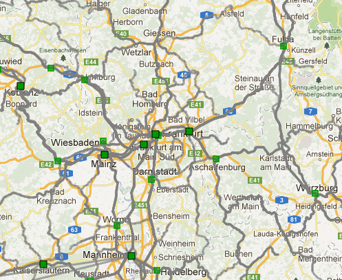
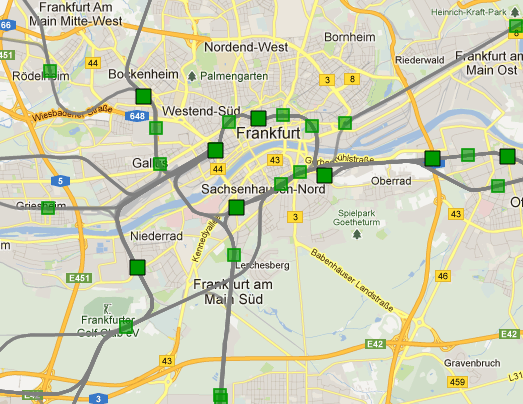

=================
Station Filtering
=================

To reduce the number of displayed stations we filter them by their usage (based
on on ``stationUsage.txt``).
In the zoomlevels 8 until 11 we display only a part of the stations, as follows:

- zoomlevel 8: stations with class 0 connections
- zoomlevel 9: stations with class 0-2 connections
- zoomlevel 10: upper 30% of stations with regional or S-Bahn connections
- zoomlevel 11: lower 70% of stations with regional or S-Bahn connections and upper 10% of remaining stations

All remaining stations are shown from zoom level 12 upwards.

Stations are valued by their amount of connections, starting with high values
for class 0 connections down to low values for tram connections.

The zoomlevel station distribution is as follows (we don't restrict stations by
coordinates):

+------------------+-----+-----+------+-------+-------+
| Zoomlevel        |   8 |   9 |   10 |    11 |   12+ |
+------------------+-----+-----+------+-------+-------+
| # shown stations | 210 | 751 | 2786 | 17078 | 83402 |
+------------------+-----+-----+------+-------+-------+

   Zoomlevel 8 (around FFM)

   Zoomlevel 12 (around FFM)

